# Model Examples

## Ingalls, B. P. (2013). Mathematical modeling in systems biology: an introduction. Cambridge, Massachusetts: MIT Press.

### Numerical Simulation
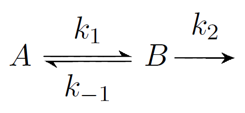 
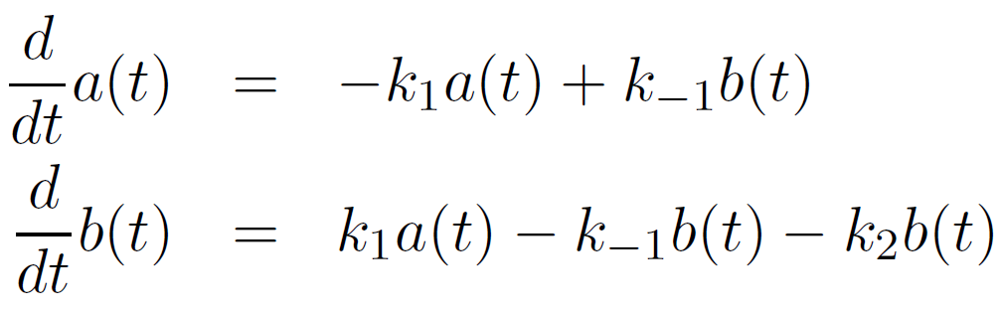

    Initial Concentrations:     A = 0, B = 10
    Kinetic Constants:          k_1 = 9, k_-1 = 12, k_2 = 2
    Time interval:              t = 1/100

- [NumericalSimulation.py](Ingalls2012_Model2.18_NumericalSimulation.py)
- [NumericalSimulation.lpp](Ingalls2012_Model2.18_NumericalSimulation.lpp)

### Michaelis Menten Kinetics
 
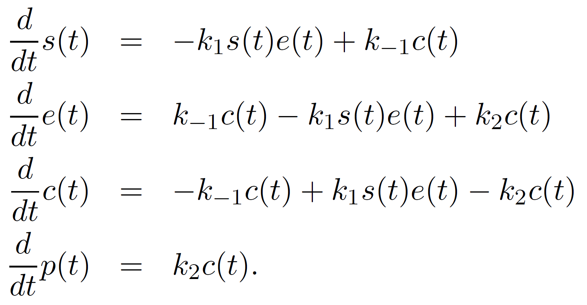 
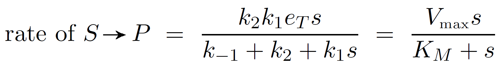 
    
    Initial Concentrations:     S = 5, E = 1, C = 0, P = 0
    Kinetic Constants:          k_1 = 30, k_-1 = 1, k_2 = 10
    Time interval:              t = 1/500

- [MichaelisMentenKinetics.py](Ingalls2012_Model3.2_MichaelisMenten.py)
- [MichaelisMentenKinetics.lpp](Ingalls2012_Model3.2_MichaelisMenten.lpp)
- Examples:

[comment]: <> (### Competitive Inhibition)

[comment]: <> (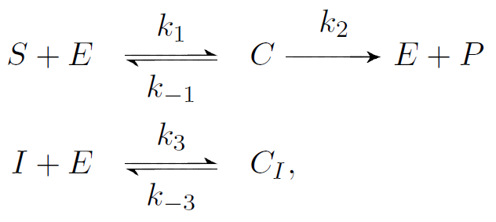 )

[comment]: <> (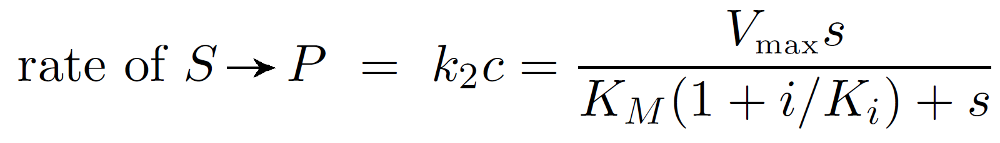 )

[comment]: <> (    Initial Concentrations:     S = [0, 1, ..., 100], E = 1, I = [0, 5, 10, 15])

[comment]: <> (    Kinetic Constants:          k_1 = 5, k_-1 = 1, k2 = 8, k3 = 2, k-3 = 1)

[comment]: <> (- [CompetitiveInhibition.py]&#40;Ingalls2012_Model3.13x_CompetitiveInhibition.py&#41;)

[comment]: <> ([comment]: <> &#40;- [AllostericRegulation.lpp]&#40;Ingalls2012_Model3.13x_CompetitiveInhibition.lpp&#41;&#41;)

[comment]: <> (- Examples: ibuprofen &#40;Nonsteroidal anti-inflammatory drug&#41;)

[comment]: <> (### Allosteric Regulation)

[comment]: <> (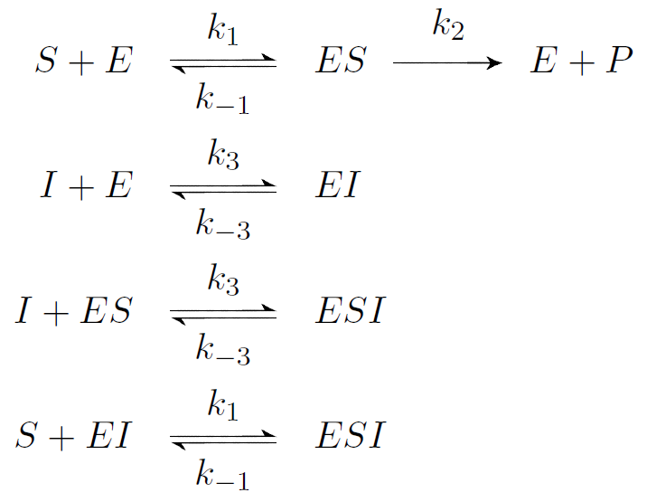 )

[comment]: <> ( )

[comment]: <> (    Initial Concentrations:     S = [0, 1, ..., 50], E = 1, I = [0, 1.5, 3, 4.5])

[comment]: <> (    Kinetic Constants:          k_1 = 5, k_-1 = 1, k2 = 8, k3 = 2, k-3 = 1)

[comment]: <> (- [AllostericRegulation.py]&#40;Ingalls2012_Model3.14_AllostericRegulation.py&#41;)

[comment]: <> (- [AllostericRegulation.lpp]&#40;Ingalls2012_Model3.14_AllostericRegulation.lpp&#41;)

[comment]: <> (- Examples: benzodiazepines &#40;depressants&#41;)

[comment]: <> (### Cooperativity: Hill Function)

[comment]: <> (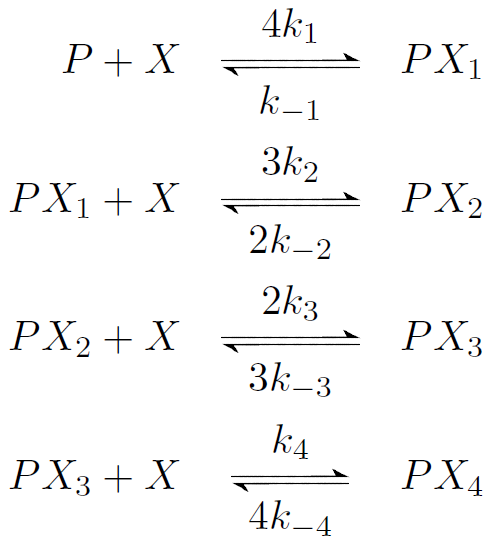 )

[comment]: <> (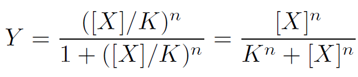 )

[comment]: <> (    Initial Concentrations:     X = [0, 1, ..., 200])

[comment]: <> (    Kinetic Constants:          K, n = [[5, 1], [20, 2], [45, 3], [80, 4]] )

[comment]: <> (- [Cooperativity.py]&#40;Ingalls2012_Model3.16_Cooperativity.py&#41;)

[comment]: <> ([comment]: <> &#40;- [Cooperativity.lpp]&#40;Ingalls2012_Model3.16_Cooperativity.lpp&#41;&#41;)

[comment]: <> (- Examples: Oxygen binding to Hemoglobin &#40;sigmoidal&#41; vs. Myoglobin &#40;hyperbolic&#41;)

### Product Inhibition
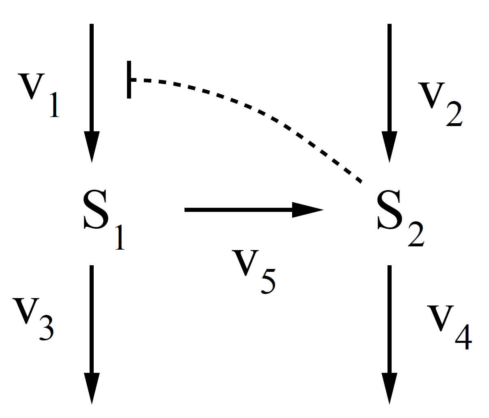 
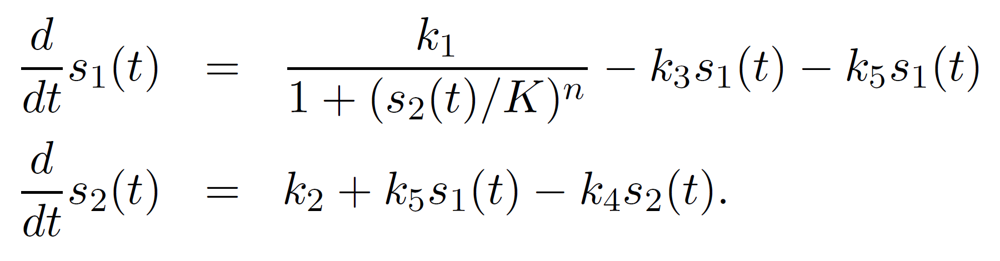

    Initial Concentrations:     X = [0, 1, ..., 200]
    Kinetic Constants:          K, n = [[5, 1], [20, 2], [45, 3], [80, 4]] 

- [ProductInhibition.py](Ingalls2012_Model4.1_ProductInhibition.py)
- [ProductInhibition.lpp](Ingalls2012_Model4.1_ProductInhibition.lpp)
- Examples: 
