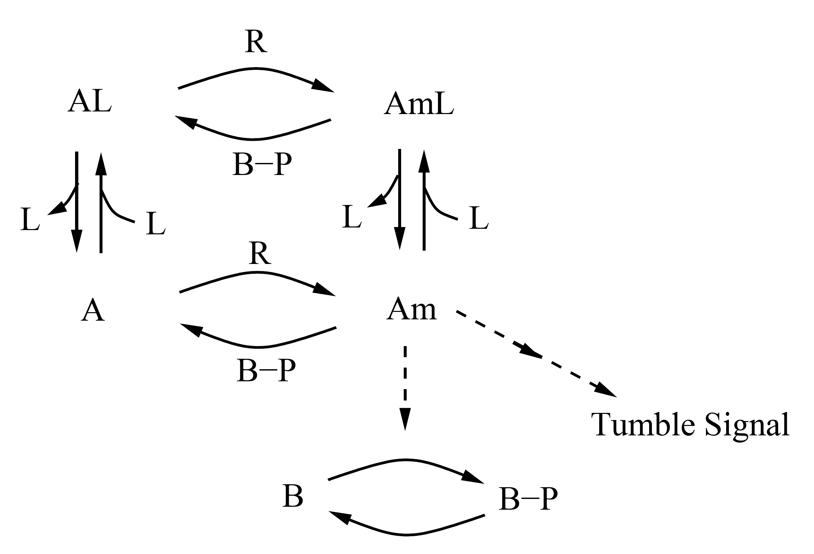
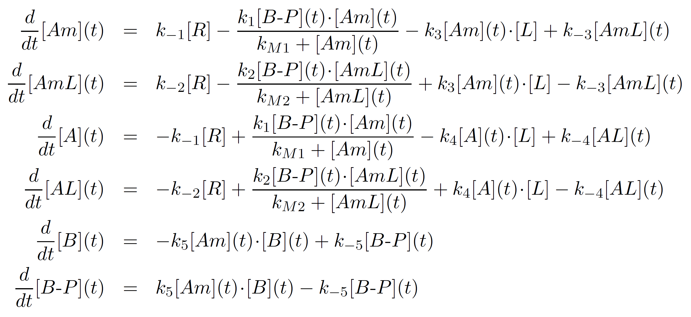

# Model Examples

## Ingalls, B. P. (2013). Mathematical modeling in systems biology: an introduction. Cambridge, Massachusetts: MIT Press.

### 1. Numerical Simulation (p.35)
 

    Initial Concentrations:     A = 0, B = 10
    Kinetic Constants:          k_1 = 9, k_-1 = 12, k_2 = 2
    Time interval:              t = 1/100

- [NumericalSimulation.py](Ingalls2013_Model2_18_NumericalSimulation.py)
- [NumericalSimulation.lpp](Ingalls2013_Model2_18_NumericalSimulation.lpp)

### 2. Full vs. Reduced (Michaelis Menten) Model (p.49)
 
 
 
    
    Initial Concentrations:     S = 5, E = 1, C = 0, P = 0
    Kinetic Constants:          Full model      | k_1 = 30, k_-1 = 1, k_2 = 10
                                Reduced model   | KM = (krev1 + k2) / k1
    Time interval:              t = 1/500

- [MichaelisMentenKinetics.py](Ingalls2013_Model3_2_MichaelisMenten.py)
- [MichaelisMentenKinetics.lpp](Ingalls2013_Model3_2_MichaelisMenten.lpp)
- Examples:

### 3. Product Inhibition (p.78)
 

    Initial Concentrations:     S1 = 0, S2 = 0
    Kinetic Constants:          k1 = 20, k2 = 5, k3 = 5, k4 = 5, k5 = 2, K = 1, n = 4 

- [ProductInhibition.py](Ingalls2013_Model4_1_ProductInhibition.py)
- [ProductInhibition.lpp](Ingalls2013_Model4_1_ProductInhibition.lpp)
- Examples: 

### 4. Stability (p.82)
 

    Initial Concentrations:     S1 = 1, S2 = 3
    Kinetic Constants:          k1 = 20, k2 = 20, k3 = 5, k4 = 5, K1 = 1, K2 = 1, n1 = 4, n2 = 1 

- [Stability.py](Ingalls2013_Model4_2_Stability.py)
- [Stability.lpp](Ingalls2013_Model4_2_Stability.lpp)
- Examples: 

### 5. Oscillations (p.93)
 

    Initial Concentrations:     S1 = 1.5, S2 = 1
    Kinetic Constants:          k0 = 8, k1 = 1, k2 = 5, K = 1, n1 = [2, 2.5] 

- [Oscillations_Damped.py](Ingalls2013_Model4_14_LimitCycleOscillations_Damped.py)
- [Oscillations_Damped.lpp](Ingalls2013_Model4_14_LimitCycleOscillations_Damped.lpp)

  
- [Oscillations_Sustained.py](Ingalls2013_Model4_14_LimitCycleOscillations_Sustained.py)
- [Oscillations_Sustained.lpp](Ingalls2013_Model4_14_LimitCycleOscillations_Sustained.lpp)
- Examples: 

### 6. Two Component Signaling (p.151)
 

    Initial Concentrations:     R = 2, RL = 0, P = 8, pP = 0, L=0
    Induced Concentrations:     L[1:3]=3
    Kinetic Constants:          k1 = 5, krev1 = 1, k2 = 6, k3 = 5 

- [TwoComponentSignaling.py](Ingalls2013_Model6_2_TwoComponentSignaling.py)
- [TwoComponentSignaling.lpp](Ingalls2013_Model6_2_TwoComponentSignaling.lpp)
- Examples: 
 
### 7. G-protein Signaling (p.154)
 

    Initial Concentrations:     RL = 2e-3*1e9, RLm = 1e-2, R=4000, G=10000
    Induced Concentrations:     L[100:700]=1e-9
    Kinetic Constants:          kGa = 1e-5, kGd0=0.11, kG1=1

- [G-proteinSignaling.py](Ingalls2013_Model6_4_G-proteinSignaling.py)
- [G-proteinSignaling.lpp](Ingalls2013_Model6_4_G-proteinSignaling.lpp)
- Examples:

### 8. Bacterial Chemotaxis (p.163)
 
 

    Initial Concentrations:     R = 5, Am = 0, AmL = 0, A = 500, AL = 0, B = 0.1, BP = 0
    Induced Concentrations:     L[0:100] = 20, L[100:300] = 40, L[300:500] = 80
    Kinetic Constants:          k1 = 200, k2 = 1, k3 = 1, k4 = 1, k5 = 0.05, 
                                krev1 = 1, krev2 = 1, krev3 = 1, krev4 = 1, krev5 = 0.005, 
                                kM1 = 1, kM2 = 1

- [BacterialChemotaxis.py](Ingalls2013_Model6_13_BacterialChemotaxis.py)
- *[BacterialChemotaxis_Vis.py](Ingalls2013_Model6_13_BacterialChemotaxis_Vis.py)
- [BacterialChemotaxis.lpp](Ingalls2013_Model6_13_BacterialChemotaxis_ForSimVis.lpp)

[comment]: <> (### Competitive Inhibition)

[comment]: <> ( )

[comment]: <> ( )

[comment]: <> (    Initial Concentrations:     S = [0, 1, ..., 100], E = 1, I = [0, 5, 10, 15])

[comment]: <> (    Kinetic Constants:          k_1 = 5, k_-1 = 1, k2 = 8, k3 = 2, k-3 = 1)

[comment]: <> (- [CompetitiveInhibition.py]&#40;Ingalls2013_Model3.13x_CompetitiveInhibition.py&#41;)

[comment]: <> ([comment]: <> &#40;- [AllostericRegulation.lpp]&#40;Ingalls2013_Model3.13x_CompetitiveInhibition.lpp&#41;&#41;)

[comment]: <> (- Examples: ibuprofen &#40;Nonsteroidal anti-inflammatory drug&#41;)

[comment]: <> (### Allosteric Regulation)

[comment]: <> ( )

[comment]: <> ( )

[comment]: <> (    Initial Concentrations:     S = [0, 1, ..., 50], E = 1, I = [0, 1.5, 3, 4.5])

[comment]: <> (    Kinetic Constants:          k_1 = 5, k_-1 = 1, k2 = 8, k3 = 2, k-3 = 1)

[comment]: <> (- [AllostericRegulation.py]&#40;Ingalls2013_Model3.14_AllostericRegulation.py&#41;)

[comment]: <> (- [AllostericRegulation.lpp]&#40;Ingalls2013_Model3.14_AllostericRegulation.lpp&#41;)

[comment]: <> (- Examples: benzodiazepines &#40;depressants&#41;)

[comment]: <> (### Cooperativity: Hill Function)

[comment]: <> ( )

[comment]: <> ( )

[comment]: <> (    Initial Concentrations:     X = [0, 1, ..., 200])

[comment]: <> (    Kinetic Constants:          K, n = [[5, 1], [20, 2], [45, 3], [80, 4]] )

[comment]: <> (- [Cooperativity.py]&#40;Ingalls2013_Model3.16_Cooperativity.py&#41;)

[comment]: <> ([comment]: <> &#40;- [Cooperativity.lpp]&#40;Ingalls2013_Model3.16_Cooperativity.lpp&#41;&#41;)

[comment]: <> (- Examples: Oxygen binding to Hemoglobin &#40;sigmoidal&#41; vs. Myoglobin &#40;hyperbolic&#41;)
