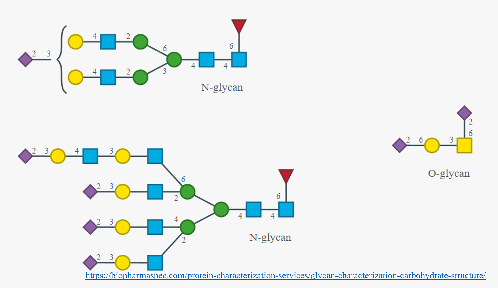

<!-- TABLE OF CONTENTS -->
<details>
  <summary>Table of Contents</summary>
  <ol>
    <li><a href="#03-L++-Syntax">L++ Syntax</a>
        <ul>
            <li><a href="#Introduction">Introduction</a></li> 
        </ul>
    </li>
    <li><a href="#Symbol-table">Symbol table</a></li> 
    <li><a href="#Keyword-table">Keyword table</a></li> 
    <li><a href="#WIP">Works In Progress</a></li>     
  </ol>
</details>


<!-- L++ Syntax -->
## L++ Syntax

<p align="right">(<a href="#top">back to top</a>)</p>

<!-- Introduction -->
## Introduction

This portion introduces the syntax and implementation of L++ code. 

<p align="right">(<a href="#top">back to top</a>)</p>

<!-- Symbol Table -->
## Reserved Symbol (single) table

|Symbol| Symbol Name |Meaning| Example|
|:-----|:---:|:---:|-------:|
|  **`.`** | period  |Location|       | 
|  **`.`** | period  | method |       | 
|  **`_`** | underscore | "of length" |  | 
| **`~`** | tilde | "bound to" | reaction r1(x + y --> x~y);     |
| **`-->`** | right arrow | Reaction formula| x --> y|
| **`=`** | equals | set to, is|  x = y|
| **`+`** | plus | "and" | reaction r1(x + y --> z); |
| **`;`** | semi-colon| end of line| reaction r1(x + y --> z);|
| **`//`** | double-forwardSlash | Comment | // Some descriptive text not compiled | 
| **`#`** | hashtag | Comment | # Some descriptive text not compiled | 

<!-- Symbol Table -->
## Reserved Symbol (paired) table

|Symbol| Symbol Name |Meaning| Example|
|:-----|:---:|:---:|-------:|
| **`"""` ... `"""`** | triple-quotes | Docstring| See [DocstringSyntax](./DocstringSyntax/)|
| **`/*` ... `*/`**   | forwardSlash-star star-forwardSlash | ReferenceID | See [DocstringSyntax](./DocstringSyntax/) |
| **`{`...`}`** | braces | | | 
| **`[`...`]`** | brackets | | |  
| **`(`...`)`** | parentheses | | |

Braces, brackets, and parentheses will likely need their own section as they are the most context dependent

### Reserved Symbol Brackets Isoforms

|Symbol| Symbol Name |Meaning| Example|
|:-----|:---:|:---:|-------:|
| **`someText{...}` OR `someText \n {...}`** |  | | |
| **`reaction r1(someText{int i} ...);`** |  | | |

### Reserved Symbol Brackets Isoforms

|Symbol| Symbol Name |Meaning| Example|
|:-----|:---:|:---:|-------:|
| **`[`...`]`** | brackets | | |
| **`variableName[:]`** | constant-variable-brackets | net change to variable quantity = 0 after simulation step |`variableName[:] = 1 nM` |  
| **`variableName[ int i ]`** | impulse-variable-brackets | variable quantity at simulation step i (must be integer) | `variableName[1] = 100 nM` |

### Reserved Symbol Parentheses Isoforms

|Symbol| Symbol Name |Meaning| Example|
|:-----|:---:|:---:|-------:|
| **`(`...`)`** | brackets | | |
| **`reaction someText();`** |  | | |
| **`pathway someText();`** |  | | |
| **`protein someText();`** |  | | |
| **`transporter someText();`** |  | | |
| **`c(NTP);`** |  |Complementary NTP | |
| **`tRNA(AA);`** |  | tRNA charged with AA | |
| **`protein some(complicated)variablename(...);`** |  |  | `transporter Iron(III)hydroxamateABCTranporter(iron(III)hydroxamate_periplasm + ATP + H2O --> iron(III)hydroxamate_cytosol + ADP + P + H);`|


## UNreserved Symbol table
Unreserved, but conventions

|Symbol|Symbol Name|Conventions| Examples |  
|:----:|:---------:|-------|----| 
| `-`    | Dash |Variable names |  | 


<!-- Keyword Table -->
## Keyword table

Insert table of keywords and short summary of each

|Keyword| Isoforms |Meaning| Example|
|:-----|:---:|:---:|-------:|
protein| | | |
complex| | | |
reaction|| | |
pathway| | | | 
DNA| `ssDNA`, `dsDNA` | | |
RNA | `tRNA`, `tRNA(AA)`, `mRNA`, etc. | 
NTP| | | |
AA| | | |
import| | | |
domain| | | | 
motif | | | |
transporter| | | |
polymerase| | | |


<p align="right">(<a href="#top">back to top</a>)</p>

<!-- WIP -->
## WIP

WIP: commas in compound names
EX: -- This would be a parsing nightmare
```sh
transporter alpha,alpha-trehalosePTSTransporter(alpha,alpha-trehalose_periplasm + HPr-P --> alpha,alpha-trehalose_cytosol + HPr);
```

WIP: syntax for molecules changing containers
Ex:
```sh
transporter IronTransporter(iron_periplasm --> iron_cytosol);
```

WIP: syntax for reactions that take classes of molecules (that are not set aside as keywords…)
Ex: (muropeptide -- Any peptidoglycan associated with a cell wall. https://en.wiktionary.org/wiki/muropeptide)

```sh
transporter muropeptideProtonSymporter(<muropeptide>_periplasm + H_periplasm --> <muropeptide>_cytosol + H_cytosol);
```

WIP: covalent bonding syntax (when new "molecule" not appropriate")
Ex: glycosylation (https://biopharmaspec.com/protein-characterization-services/glycan-characterization-carbohydrate-structure/)

<figure>
  
  <figcaption><b>Glycosylation Example</b></figcaption>
</figure>

<p align="right">(<a href="#top">back to top</a>)</p>


